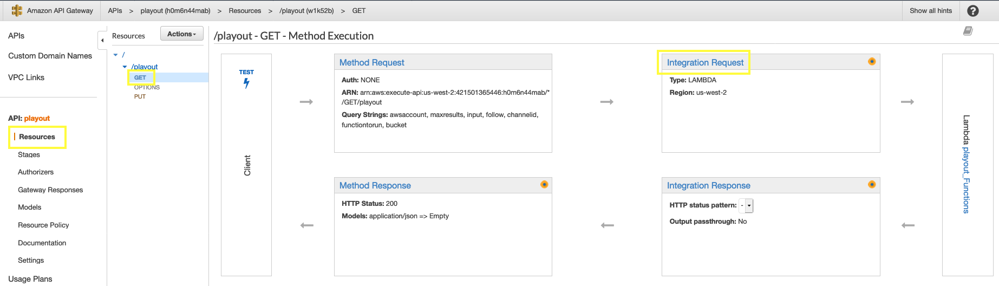
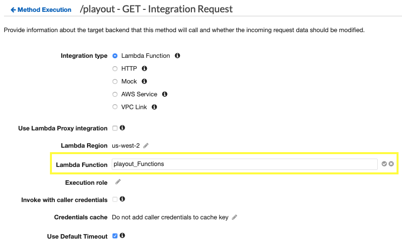
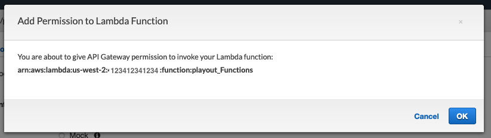
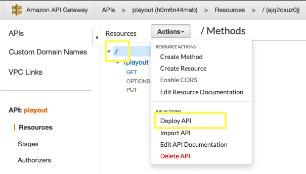
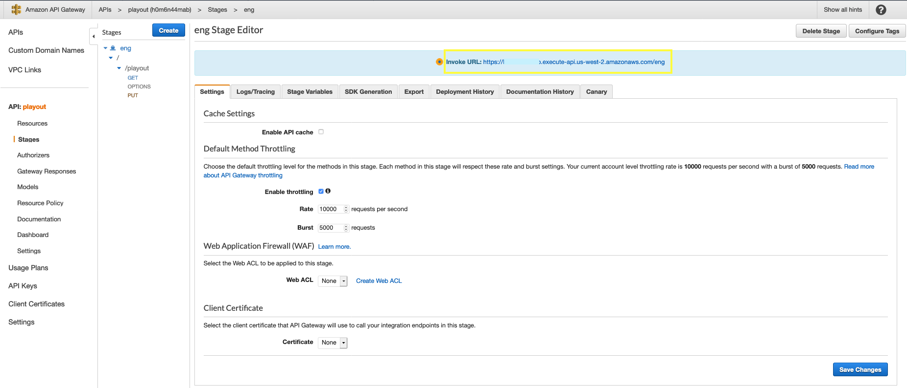

# Channel Playout Management UI
These setup instructions are for an instructor looking to deploy this dashboard as part of an AWS workshop.


## Setup Instructions for the **Instructor's Account**
Services to deploy and configure:

* IAM
* Amazon S3
* AWS Lambda
* Amazon API Gateway
* Amazon EC2

*Optionally, the instructor can also deploy the services that will feature in the workshop (instructions for setting up these items are featured in this instruction manual):*

* AWS Elemental MediaLive
* AWS Elemental MediaPackage
* AWS Elemental MediaConnect

---
### IAM
---

The instructor will need to:

1. Create an IAM role for AWS Lambda, including policies for local service access as well as trainee account access

1. Create an IAM role for MediaLive (optional if the instructor is deploying the solution on this account)

1. Create an IAM role for MediaConnect (optional if the instructor is deploying the solution on this account)

#### AWS Lambda Role
1. In the IAM Console, select **Roles** from the navigation pane and then the 'Create Role' button

2. Under 'Trusted entity', select **AWS Service**, then select 'Lambda' from the available services displayed. Click **Next: Permissions** 

3. Search for 'S3ReadOnlyAccess', tick the box to the left of the result to add this policy to the role. Then clear the search box and search for 'AmazonAPIGatewayInvokeFullAccess', tick the box to the left of the result, then select **Create Policy**, this will open a new tab to create a custom policy.

4. Under **Service**, search for and select 'MediaLive', under **Actions** select 'All MediaLive Actions'. Under **Resources** select 'All resources', then select **Review Policy**


5. Call the policy 'MediaLiveFullAccess', then select **Create policy**

6. Go back to the Create role tab in your browser, select the refresh button and then tick the box to the left of the result


7. Click on **Next: Tags**

8. Click on **Next: Review**

9. In the **Role name** field, enter 'AWSLambdaAccessToS3AndEML'

10. Select **Create role**

11. Whilst still in the **Roles** section of IAM, search for the role just created 'AWSLambdaAccessToS3AndEML' - click on the result to go into the role configuration


12. In the Permissions tab, select **Add inline policy**


13. Select the JSON tab, then paste the below policy. *Replace the account numbers (ie. 111111111111) with the trainee account number(s)*

```json
{
    "Version": "2012-10-17",
    "Statement": {
        "Effect": "Allow",
        "Action": "sts:AssumeRole",
        "Resource": [
            "arn:aws:iam::111111111111:role/AssumeRoleLambda",
            "arn:aws:iam::222222222222:role/AssumeRoleLambda",
            "arn:aws:iam::333333333333:role/AssumeRoleLambda"
        ]
    }
}
```

**IMPORTANT: The role specified in this inline policy, 'AssumeRoleLambda', will need to be created in each of the trainee accounts. See the section 'Setup Instructions for the Trainees's Account' for more details**

#### MediaLive Role

The best way to create a MediaLive role with the right policies is to first get MediaLive to create a role automatically. We will then go and edit the role to contain what we need.

1. In the AWS console, search for MediaLive and select the result to go to the MediaLive Console.

1. Click on **Create Channel**, don't worry, we're not actually going to create the channel 


3. Under **Create Channel**, click on **Channel and input details**

3. Click on **Create role from template**, then the **Create IAM role** button


5. You will see a role has been successfully created


6. Don't go any further in the channel configuration, instead, navigate to the IAM console.

6. Go to the **Roles** section and search for the role that MediaLive just created, it should be called 'MediaLiveAccessRole'. Click on the returned result.


8. In the Permissions tab, click on the **MediaLiveCustomPolicy**, then select the **Edit Policy** button.


9. In the Policy editor, select the **JSON** tab, then paste the contents of the below json block into the editor.


Policy json code block:

```json
{
    "Version": "2012-10-17",
    "Statement": [
        {
            "Effect": "Allow",
            "Action": [
                "s3:ListBucket",
                "s3:PutObject",
                "s3:GetObject",
                "s3:DeleteObject"
            ],
            "Resource": "*"
        },
        {
            "Effect": "Allow",
            "Action": [
                "mediastore:ListContainers",
                "mediastore:PutObject",
                "mediastore:GetObject",
                "mediastore:DeleteObject",
                "mediastore:DescribeObject"
            ],
            "Resource": "*"
        },
        {
            "Effect": "Allow",
            "Action": [
                "logs:CreateLogGroup",
                "logs:CreateLogStream",
                "logs:PutLogEvents",
                "logs:DescribeLogStreams",
                "logs:DescribeLogGroups"
            ],
            "Resource": "arn:aws:logs:*:*:*"
        },
        {
            "Effect": "Allow",
            "Action": [
                "mediaconnect:ManagedDescribeFlow",
                "mediaconnect:ManagedAddOutput",
                "mediaconnect:ManagedRemoveOutput"
            ],
            "Resource": "*"
        },
        {
            "Effect": "Allow",
            "Action": [
                "ec2:describeSubnets",
                "ec2:describeNetworkInterfaces",
                "ec2:createNetworkInterface",
                "ec2:createNetworkInterfacePermission",
                "ec2:deleteNetworkInterface",
                "ec2:deleteNetworkInterfacePermission",
                "ec2:describeSecurityGroups"
            ],
            "Resource": "*"
        },
        {
            "Effect": "Allow",
            "Action": [
                "mediapackage:DescribeChannel"
            ],
            "Resource": "*"
        }
    ]
}
```

10. Select **Review Policy**

10. Select **Save Changes**

#### MediaConnect Role
1. In the IAM Console, select **Roles** from the navigation pane and then the 'Create Role' button

2. Under 'Trusted entity', select **AWS Service**, then select 'EC2' from the available services displayed (we have to change the trusted entity to MediaConnect after the role is created). Click **Next: Permissions** 

3. Search for 'AmazonVPCFullAccess', tick the box to the left of the result to add this policy to the role.

7. Click on **Next: Tags**

8. Click on **Next: Review**

9. In the **Role name** field, enter 'MediaConnectFullAccessToVPC'

10. Select **Create role**

*Now the role has been created with the correct policy, we need to change the trusted identity from ec2 to mediaconnect.*

11. In the IAM Console, select **Roles** from the navigation pane and then search for the role just created in the search box 'MediaConnectFullAccessToVPC'. Click on the result displayed in the table


12. In the Role Summary page, select the **Trust Relationships** tab, then **Edit Trust Relationship**

13. In the policy document, replace 'ec2' with 'mediaconnect'


14. Select **Update Trust Policy**

---
### Amazon S3
---

The instructor will need to:

1. Create or use an existing S3 bucket. *Instructions for bucket creation are not featured in this instruction manual.*

1. Move content in **MP4** format into the bucket to be used as source content. *Instructions for content curation are not featured in this instruction manual.*

1. Apply a bucket policy containing the account numbers for the trainee accounts, allowing actions **List Bucket, GetObject, GetObjectTagging**. This will ensure that MediaLive will have access to these files.

To apply the bucket policy, go to the **S3 Console**, select the bucket that you will use, then go to **Permissions -> Bucket Policy**

Paste the following policy into the bucket, with changes specific to your event... In the **Principle > AWS** section, include the AWS accounts of the trainees. In the **Resources** section, change the below example of 'workshop-content' with the name of your bucket.

```json
{
    "Version": "2012-10-17",
    "Statement": [
        {
            "Sid": "DelegateS3Access",
            "Effect": "Allow",
            "Principal": {
                "AWS": [
                    "arn:aws:iam::111122223333:root",
                    "arn:aws:iam::222233334444:root"
                ]
            },
            "Action": [
                "s3:ListBucket",
                "s3:GetObject",
                "s3:GetObjectTagging"
            ],
            "Resource": [
                "arn:aws:s3:::workshop-content/*",
                "arn:aws:s3:::workshop-content"
            ]
        }
    ]
}
```
### AWS Lambda
---

#### AWS Lambda Functions Configuration
We will create 6 Lambda functions in this section. Get the function code from the /lambdafunctions/workshop directory in this repository

1. Login to the AWS Management Console

2. Navigate to the AWS Lambda Console

3. Under Functions, select **Create Function**

4. Select **Author from scratch**

5. Give the Function a Name, please stick to this format:

| Function Name       | Runtime         | Zip file                |
| ------------------- | --------------- | ----------------------- |
| eml_immediateSwitch | python 3.7      | eml_immediateSwitch.zip
| eml_followCurrent   | python 3.7      | eml_followCurrent.zip
| eml_followCustom    | python 3.7      | eml_followCustom.zip
| eml_followLast      | python 3.7      | eml_followLast.zip
| eml_getSchedule     | python 3.7      | eml_getSchedule.zip
| s3_getAssetList     | python 3.7      | s3_getAssetList.zip

6. Under **Permissions**, select 'Use an existing role', and then choose the role created earlier : **AWSLambdaAccessToS3AndEML**


7. Select **Create Function**

8. Under the **Function Code** section, change the 'Code entry type' to **Upload a zip file**. Select the Upload button and browse to the ZIP file for this function.


9. After the code has imported, scroll down to the **Basic Settings** section, press the 'Edit' button and change the Timeout value to 2 minutes.


10. Select the **Save** button and return to the Functions dashboard.

11. Repeat steps 3 to 10 for all of the functions

---
### Amazon API Gateway
---

#### Amazon API Gateway Configuration
1. Open the 'playoutAPI-eng-swagger-apigateway-ext.json' file in the apigatewayjson directory of this repo. Do a Find and Replace on all occurrences of : '112233445566' Replace this number with your AWS account number that is hosting the AWS Lambda Functions. There should be 6 occurrences.

*You can find your account number in the AWS console, under the account drop-down menu*


2. Login to the AWS Management Console

3. Navigate to the Amazon API Gateway Console

4. Select **Create API**

5. Under API Type, choose to **Import** a **REST API**


6. Under Choose the protocol, select **REST**, and under Create new API, select **Import from Swagger or Open API 3**. Then paste the contents from the edited 'playoutAPI-eng-swagger-apigateway-ext.json' file

7. Select **Import**


8. To verify that the API endpoints correspond to your AWS Lambda functions, click on the PUT or GET 'Method' below each Resource, then select the AWS Lambda function hyperlink on the right hand side of the Execution flow. Clicking the link should open up your Lambda function.

9. In order for API Gateway to be granted access to execute the AWS Lambda functions, you have to edit and save the function in the **Integration Request** execution settings. Under **Resources** click on the GET or PUT Method for the Resource, then select **Integration Request**. Click on the pencil next to the **Lambda Function** field, and then press the tickbox. Then click OK. API Gateway now has permissions to execute the Lambda function.







10. Repeat the above step for all API Resources

10. To deploy the API, click on the root slash, then the **Actions** button, followed by **Deploy API**



11. In the **Deploy API** options, choose to create a new 'Deployment Stage'. Give the stage the name **eng** exactly as written here and displayed in the picture below. *the name 'eng' is required for backend functions to work correctly*


12. Click on **Save Changes** and take note of the **Invoke URL**, this is the API endpoint that's needed in the EC2 Server Configuration section of these instructions.



---
### Amazon EC2
---

The instructor will need to deploy an EC2 instance 

#### EC2 Deployment (Dashboard & MCR Host)
1. Login to the AWS Management Console

2. Navigate to the EC2 Console

3. Click **Instances**, then **Launch Instance**


4. Select the Amazon Linux 2 AMI (this should be shown in the 'Quick Start' tab)


5. For Instance Type, choose **t2.large** or equivalent, then select **Next: Configure Instance Details**

*Assumption: You are using the default VPC or a custom VPC that you have attached an Internet Gateway to. Remember, this Virtual Machine will need Internet access...*

6. Number of Instances : 1

7. Network : [Select your VPC]

8. Subnet : Choose a Subnet that has a route to the Internet

9. Auto-assign Public IP : Enable

10. Expand the **Advanced Details** section. In the 'User Data' field, paste in the below text:

```bash
#!/bin/bash
sudo yum -y install git
sudo git clone https://github.com/scunning1987/channelPlayoutManagementUI.git
cd channelPlayoutManagementUI
sudo /bin/bash install-amazonlinux.sh
```

This is what is will look like...


*Leave all other fields in this step of the wizard to default*

11. Click **Next: Add Storage**

12. Optional : If you want your EBS volume to be encrypted, select the Encryption drop-down and choose the default option

13. Click **Next: Add Tags**

14. Click **Add Tag**

15. In the **Key** field, enter 'Name', in the **Value** field, enter the name for this server. For Example : Channel_Playout_Host. This name will appear in the EC2 console when it is deployed

16. Click **Next: Configure Security Group**

17. Click the 'Create new security group' button

18. In the **Security group name** field, enter 'channel-playout-sg'

19. In the **Description** field, enter 'security group for channel playout host'

20. Click the **Add Rule** button to display a new row, here are the required rules:

| Type       | Protocol | Port Range | Source            | Description                      |
| ---------- | -------- | ---------- | ------------      | -------------------------------- |
| SSH        | TCP      | 22         | Custom: 0.0.0.0/0 | SSH access                       |
| HTTP       | TCP      | 80         | Custom: 0.0.0.0/0 | HTTP Web Access                  |
| Custom TCP | TCP      | 1935       | Custom: 0.0.0.0/0 | RTMP Access                      |
| Custom TCP | TCP      | 20000      | Custom: 0.0.0.0/0 | RTP Stream From MediaConnect     |
| Custom UDP | UDP      | 20000      | Custom: 0.0.0.0/0 | UDP Stream From MediaConnect     |


*For extra security, you can specify the source IP address ranges that can communicate with this EC2 instance. You can edit security group rules at any time after creation, and any changes will take effect immediately.*

Here's what your Security Group should look like


21. Click **Review and Launch**

22. Click **Launch**

23. You will be prompted to select or create a new key pair (for ssh access). Select **Create a new key pair** from the drop-down menu and give the key file a suitable name:  ec2-us-west-2


24. Download the key pair, then select **Launch Instances**

25. You will get a success message saying that 'Your instances are now launching'. Select the **View Instances** button to return to the EC2 dashboard in the Instances section.


Now our EC2 Web & RTMP Server is up and running! Please take note of some information that we'll need later:

| Private IP   | Public DNS or IPv4 IP                             |
| ------------ | ------------------------------------------------- |
| 172.1.2.3    | ec2-52-24-130-125.us-west-2.compute.amazonaws.com |

*Note: If you turn off your instance and then turn it back on, it will be assigned a new Public IPv4 and DNS address. The private IP address does not change, however.*

After a few minutes you can validate that the server had all its applications installed successfully by trying to load the UI in your browser:

http://[Public DNS or IPv4 IP]/mcr/softpanel.html

Example:
http://ec2-52-24-130-125.us-west-2.compute.amazonaws.com/mcr/softpanel.html

#### EC2 Server Configuration with API Endpoints
For simplicity, a configuration dashboard is available for you to enter your target URL's, including API Gateway endpoint, and HLS endpoint.

Using your EC2's public IP or FQDN, navigate to this page in your browser (replace the IP below with your public address):

http://12.23.34.45/`dashboard-master.html`

Enter the following information: 

* EC2 IP : example : 12.23.34.45 (enter the IP address only)

* HLS URL : example : http://mediapackage.net/index.m3u8 (get this information from your MediaPackage endpoint or CloudFront distribution)

* API URL : example : https://myapigateway.net/eng (get this information from your API Gateway endpoint in the API Gateway console, in the 'eng' stage section)


Click the **Update All** button once you've filled out all of the details

*Note: you will need to refresh your browser for any of these changes to take effect on your dashboard page, and you may even require a cache clear*

---
## Setup Instructions for the **Trainees's Account**
---

Services to deploy and configure:

* IAM

---
### IAM
---

All you have to do is create a Lambda role that the Lambda functions in the instructor account can assume.  See below instructions.

#### AWS Lambda Role
1. In the IAM Console, select **Roles** from the navigation pane and then the 'Create Role' button

2. Under 'Trusted entity', select **AWS Service**, then select 'Lambda' from the available services displayed. Click **Next: Permissions** 

3. Search for 'S3ReadOnlyAccess', tick the box to the left of the result to add this policy to the role. Then clear the search box and search for 'AmazonAPIGatewayInvokeFullAccess', tick the box to the left of the result, then select **Create Policy**, this will open a new tab to create a custom policy.

4. Under **Service**, search for and select 'MediaLive', under **Actions** select 'All MediaLive Actions'. Under **Resources** select 'All resources', then select **Review Policy**


5. Call the policy 'MediaLiveFullAccess', then select **Create policy**

6. Go back to the Create role tab in your browser, select the refresh button and then tick the box to the left of the result


7. Click on **Next: Tags**

8. Click on **Next: Review**

9. In the **Role name** field, enter 'AWSLambdaAccessToS3AndEML'

10. Select **Create role**

11. Whilst still in the **Roles** section of IAM, search for the role just created 'AWSLambdaAccessToS3AndEML' - click on the result to go into the role configuration


12. Click on the **Trust Relationships** tab, then select **Edit Trust Relationship**


13. In the JSON editor, add an **"AWS"** key, and copy the ARN of the Lambda role from the instructor account. The below arn is only an example:

```json
{
  "Version": "2012-10-17",
  "Statement": [
    {
      "Effect": "Allow",
      "Principal": {
        "Service": "lambda.amazonaws.com",
        "AWS": "arn:aws:iam::111111111111:role/AWSLambdaFullAccessToS3andEML"
      },
      "Action": "sts:AssumeRole",
      "Condition": {}
    }
  ]
}
```


---
## Optional Deployment For Instructor Account
---

### AWS Elemental MediaPackage Configuration
Optional

### AWS Elemental MediaConnect Configuration
Optional

### AWS Elemental MediaLive Configuration
Optional