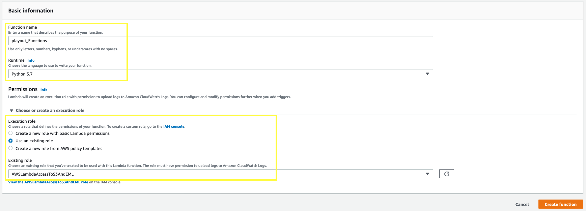
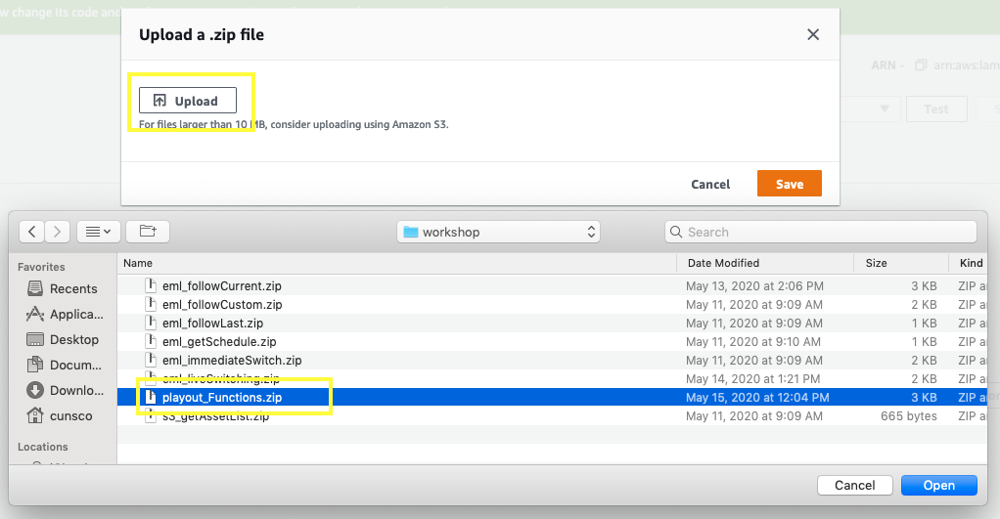

# Channel Playout Management UI
This repo contains all of the tools and instructions necessary for you to deploy and build an HTML dashboard, capable of interfacing with, and creating a playout schedule for AWS Elemental MediaLive. This is what the finished product will look like!


## Assumptions
These instructions assume that:

- You've already created an AWS account
- Your IAM user has full administrator access
- You have sample content in an S3 bucket that has been sanitized to MP4 format
- Other assumptions will be called out in the instructions


## Architecture
The architecture utilizes these AWS Services:
- AWS Elemental MediaLive (this is the playout engine)
- AWS Elemental MediaPackage (this service packages the OTT stream and acts as an origin)
- AWS Elementa MediaConvert (this service is responsible for reliably distributing transport stream video)
- Amazon S3 (this storage service will be the origin for our playout assets)
- Amazon EC2 (this virtual compute service will be where we host our dashboard site and transmux the output of MediaConnect to RTMP for display)
- Amazon API Gateway
- AWS Lambda
- IAM


## Deployment Instructions
Follow the below instructions to deploy each component in the workflow...

1. IAM Role Configuration

1. AWS Lambda Functions Configuration

1. Amazon API Gateway Configuration

1. EC2 Deployment

1. EC2 Server Configuration with API Endpoints

1. AWS Elemental MediaPackage Configuration

1. AWS Elemental MediaConnect Configuration

1. AWS Elemental MediaLive Configuration

### IAM Roles Creation
We need to create a lot of Service roles in order for the AWS Services to work as expected. The list of Roles include:

1. AWS Lambda Role - Attach polices for APIGatewayInvoke, MediaLive, ElasticSearch, and S3 access

1. AWS Elemental MediaConnect Role - Attach policies for VPC access

1. AWS Elemental Live Role - Attach policies for S3, SSM, MediaPackage, EC2, CloudWatch, MediaStore, MediaConnect, VPC

1. Amazon EC2 (optional) - Attach policies for S3, and ElasticSearch access

All of the below Roles will be added using the AWS Console, so log into your account and navigate to the IAM 

#### AWS Lambda Role
1. In the IAM Console, select **Roles** from the navigation pane and then the 'Create Role' button

2. Under 'Trusted entity', select **AWS Service**, then select 'Lambda' from the available services displayed. Click **Next: Permissions** 

3. Search for 'S3ReadOnlyAccess', tick the box to the left of the result to add this policy to the role. Then clear the search box and search for 'AmazonAPIGatewayInvokeFullAccess', tick the box to the left of the result, then select **Create Policy**, this will open a new tab to create a custom policy.

4. Under **Service**, search for and select 'MediaLive', under **Actions** select 'All MediaLive Actions'. Under **Resources** select 'All resources', then select **Review Policy**


5. Call the policy 'MediaLiveFullAccess', then select **Create policy**

6. Go back to the Create role tab in your browser, select the refresh button and then tick the box to the left of the result


#### AWS Elemental MediaConnect Role
.

#### AWS Elemental Live Role
.

#### Amazon EC2 (optional)
.

### AWS Lambda Functions Configuration
We will create 6 Lambda functions in this section. Get the function code from the /lambdafunctions directory in this repository

1. Login to the AWS Management Console

2. Navigate to the AWS Lambda Console

3. Under Functions, select **Create Function**

4. Select **Author from scratch**

5. Give the Function a Name, please stick to this format:

| Function Name       | Runtime         | Zip file                |
| ------------------- | --------------- | ----------------------- |
| eml_immediateSwitch | python 3.7      | eml_immediateSwitch.zip
| eml_followCurrent   | python 3.7      | eml_followCurrent.zip
| eml_followCustom    | python 3.7      | eml_followCustom.zip
| eml_followLast      | python 3.7      | eml_followLast.zip
| eml_getSchedule     | python 3.7      | eml_getSchedule.zip
| s3_getAssetList     | python 3.7      | s3_getAssetList.zip

6. Under **Permissions**, select 'Use an existing role', and then choose the role created earlier : **AWSLambdaAccessToS3AndEML**



7. Select **Create Function**

8. Under the **Function Code** section, change the 'Code entry type' to **Upload a zip file**. Select the Upload button and browse to the ZIP file for this function.



9. After the code has imported, scroll down to the **Basic Settings** section, press the 'Edit' button and change the Timeout value to 2 minutes.


10. Select the **Save** button and return to the Functions dashboard.

11. Repeat steps 3 to 10 for all of the functions

### Amazon API Gateway Configuration
1. Open the 'playoutAPI-eng-swagger-apigateway-ext.json' file in the apigatewayjson directory of this repo. Do a Find and Replace on all occurrences of : '112233445566' Replace this number with your AWS account number that is hosting the AWS Lambda Functions. There should be 6 occurrences.

*You can find your account number in the AWS console, under the account drop-down menu*


2. Login to the AWS Management Console

3. Navigate to the Amazon API Gateway Console

4. Select **Create API**

5. Under API Type, choose to **Import** a **REST API**


6. Under Choose the protocol, select **REST**, and under Create new API, select **Import from Swagger or Open API 3**. Then paste the contents from the edited 'playoutAPI-eng-swagger-apigateway-ext.json' file

7. Select **Import**


8. To verify that the API endpoints correspond to your AWS Lambda functions, click on the PUT or GET 'Method' below each Resource, then select the AWS Lambda function hyperlink on the right hand side of the Execution flow. Clicking the link should open up your Lambda function.

9. To deploy the API, click on the root slash, then the **Actions** button, followed by **Deploy API**


10. In the **Deploy API** options, choose to create a new 'Deployment Stage', call it 'eng'. Optionally, give the stage a description.


11. Click on **Save Changes** and take note of the **Invoke URL**, this is the API endpoint that's needed in the EC2 Server Configuration section of these instructions.


### EC2 Deployment (Dashboard & MCR Host)
1. Login to the AWS Management Console

2. Navigate to the EC2 Console

3. Click **Instances**, then **Launch Instance**


4. Select the Amazon Linux 2 AMI (this should be shown in the 'Quick Start' tab)


5. For Instance Type, choose **t2.large** or equivalent, then select **Next: Configure Instance Details**

*Assumption: You are using the default VPC or a custom VPC that you have attached an Internet Gateway to. Remember, this Virtual Machine will need Internet access...*

6. Number of Instances : 1

7. Network : [Select your VPC]

8. Subnet : Choose a Subnet that has a route to the Internet

9. Auto-assign Public IP : Enable

10. Expand the **Advanced Details** section. In the 'User Data' field, paste in the below text:

```bash
#!/bin/bash
sudo yum -y install git
sudo git clone https://github.com/scunning1987/channelPlayoutManagementUI.git
cd channelPlayoutManagementUI
sudo /bin/bash install-amazonlinux.sh
```

This is what is will look like...


*Leave all other fields in this step of the wizard to default*

11. Click **Next: Add Storage**

12. Optional : If you want your EBS volume to be encrypted, select the Encryption drop-down and choose the default option

13. Click **Next: Add Tags**

14. Click **Add Tag**

15. In the **Key** field, enter 'Name', in the **Value** field, enter the name for this server. For Example : Channel_Playout_Host. This name will appear in the EC2 console when it is deployed

16. Click **Next: Configure Security Group**

17. Click the 'Create new security group' button

18. In the **Security group name** field, enter 'channel-playout-sg'

19. In the **Description** field, enter 'security group for channel playout host'

20. Click the **Add Rule** button to display a new row, here are the required rules:

| Type       | Protocol | Port Range | Source            | Description                      |
| ---------- | -------- | ---------- | ------------      | -------------------------------- |
| SSH        | TCP      | 22         | Custom: 0.0.0.0/0 | SSH access                       |
| HTTP       | TCP      | 80         | Custom: 0.0.0.0/0 | HTTP Web Access                  |
| Custom TCP | TCP      | 1935       | Custom: 0.0.0.0/0 | RTMP Access                      |
| Custom TCP | TCP      | 20000      | Custom: 0.0.0.0/0 | RTP Stream From MediaConnect     |
| Custom UDP | UDP      | 20000      | Custom: 0.0.0.0/0 | UDP Stream From MediaConnect     |


*For extra security, you can specify the source IP address ranges that can communicate with this EC2 instance. You can edit security group rules at any time after creation, and any changes will take effect immediately.*

Here's what your Security Group should look like


21. Click **Review and Launch**

22. Click **Launch**

23. You will be prompted to select or create a new key pair (for ssh access). Select **Create a new key pair** from the drop-down menu and give the key file a suitable name:  ec2-us-west-2


24. Download the key pair, then select **Launch Instances**

25. You will get a success message saying that 'Your instances are now launching'. Select the **View Instances** button to return to the EC2 dashboard in the Instances section.


Now our EC2 Web & RTMP Server is up and running! Please take note of some information that we'll need later:

| Private IP   | Public DNS or IPv4 IP                             |
| ------------ | ------------------------------------------------- |
| 172.1.2.3    | ec2-52-24-130-125.us-west-2.compute.amazonaws.com |

*Note: If you turn off your instance and then turn it back on, it will have been assigned a new Public IPv4 and DNS address. The private IP address does not change, however.*

After a few minutes you can validate that the server had all its applications installed successfully by trying to load the UI in your browser:

http://[Public DNS or IPv4 IP]/mcr/softpanel.html

Example:
http://ec2-52-24-130-125.us-west-2.compute.amazonaws.com/mcr/softpanel.html

### EC2 Server Configuration with API Endpoints
There isn't much you need to do to configure the EC2 instance; except updating the API endpoint URL, and the HLS retrieval URL (if you don't have a HLS retrieval URL, then go through the MediaPackage setup instructions)

1. SSH into the EC2 instance (You can get connection instructions in the EC2 console, click on your EC2 instance, then the **Connect** button). You will need to use the PEM key that you specified when creating the ec2 instance 


2. Use vi to edit the webpages javascript file, and replace the **hlsURL** and **apiendpointurl** variables at the top of the page with your URL's.

3. Save the file.

```bash
//pagescript.js
  
//hls url
const hlsURL = "https://c4af3793bf76b11f.mediapackage.us-west-2.amazonaws.com/out/v1/4cf83c6c52104ef4843d77d2f8578c66/index.m3u8"

//apiendpointurl
const apiendpointurl = "https://940r6t3ds2.execute-api.us-west-2.amazonaws.com/eng/"
```

*Note: you will need to refresh your browser for any of these changes to take effect on your dashboard page, and you may even require a cache clear*